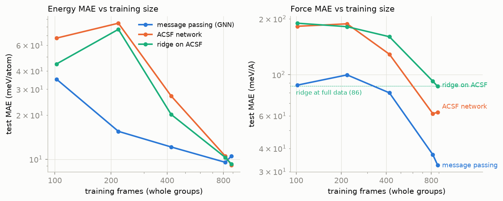

# graph-neural-forcefield

A from-scratch SchNet-style message-passing neural network potential for
BCC Ti-Zr-Nb refractory alloys, benchmarked head to head against the
descriptor approach (a compact Behler-Parrinello ACSF network and a ridge
regression on the same descriptors) at matched training data and matched
budget. Everything that matters is implemented from first principles in
PyTorch: the periodic neighbor list, the batched graphs, the
continuous-filter interaction blocks, the ACSF descriptors, the training
loop, the Birch-Murnaghan EOS fit, and the velocity-Verlet NVE integrator.
Forces are exact autograd gradients everywhere.

**Label integrity, first.** Every training label in this project is a
surrogate model label from a pretrained universal potential (CHGNet 0.4.2,
default MPtrj-trained checkpoint, BSD-3-Clause), chosen over MACE-MP-0
small by measured CPU speed (0.18 vs 0.50 s per 54-atom call). The labels
are never DFT and are never called DFT. Real DFT enters exactly once: as
Materials Project equation-of-state anchors (CC BY 4.0) used for
validation. All errors below are errors against the teacher.

## The headline: what message passing buys, measured



Test error versus training-set size at matched budget, leakage-safe splits
everywhere. Three results carry the repository:

1. **Forces are the GNN's decisive win.** At full data (882 frames): force
   MAE 30.9 meV/A vs 60.0 (ACSF network) vs 86.5 (ridge), with even larger
   RMSE gaps (43 vs 115 vs 148 meV/A: the descriptor models have heavy
   error tails). With only 102 training frames the GNN already matches the
   force accuracy the ridge baseline needs all 882 frames to reach.
2. **Energies are not where the win is.** At full data all three models
   land within about 1.5 meV/atom of each other (and the ordering flips
   between reruns); on the two held-out transfer compositions the
   147-parameter ridge nearly matches the GNN (6.77 vs 6.38 meV/atom).
   On this narrow BCC chemistry, linear-in-descriptors extrapolates
   composition energetics well.
3. **The leaky protocol flatters the wrong model.** A random-frame split
   (siblings from one rattle or MD batch on both sides) improves the
   descriptor net's apparent numbers by 15-17 percent and shrinks its
   apparent seed spread 5x, while the GNN's numbers do not move. Only
   group-split numbers are quoted anywhere here.

| Model (this repo, matched budget) | Params | Test E MAE (meV/atom) | Test F MAE (meV/A) | CPU inference, 54 atoms |
|---|---|---|---|---|
| Message-passing GNN (3 blocks, width 48) | 40,082 | **7.00** | **30.9** | 11.8 ms |
| ACSF network (48 features, 32x32) | 7,971 | 8.20 | 60.0 | 13.3 ms |
| Ridge on the same ACSF features | 147 | 9.29 | 86.5 | 9.7 ms |

Physics of the trained GNN: equation of state within 0.01 A of the teacher
for Nb and equiatomic TiZrNb (Zr is the honest weak spot, documented in
[RESULTS.md](RESULTS.md)); NVE drift at or below 0.0003 meV/atom/ps over
3 ps at 300-900 K; energy exactly flat beyond the cutoff and smooth across
it; rotation, translation, and permutation invariance at machine
precision. Full tables, the split-protocol control, and a fairness
correction made during the build are in [RESULTS.md](RESULTS.md).

## Install and run

```
python -m venv .venv
.venv\Scripts\activate          # Windows; on Linux/macOS: source .venv/bin/activate
pip install torch --index-url https://download.pytorch.org/whl/cpu
pip install -e .[teacher]       # chgnet needed for labeling and EOS-vs-teacher
```

Instant demo on the committed sample data and checkpoints (no generation
step, no downloads):

```
gnff eval    --checkpoint models/mpnn.pt --data data/sample_frames.extxyz
gnff predict --checkpoint models/mpnn.pt --structure data/sample_frames.extxyz
gnff eos     --checkpoint models/mpnn.pt --composition Nb
gnff md      --checkpoint models/mpnn.pt --composition TiZrNb --temperature 300 --steps 200
```

Full reproduction (regenerates the dataset with fixed seeds, retrains all
three models, reruns every benchmark, rebuilds figures and metrics; about
two and a half hours on CPU):

```
python scripts/run_all.py
```

## Library in three lines

```python
from gnff import MpnnPotential, MpnnConfig, TrainSettings, train_potential, read_extxyz, group_split

frames = read_extxyz("data/sample_frames.extxyz")
split = group_split(frames, holdout_compositions=("Ti2ZrNb", "TiZrNb2"), seed=0)
```

`docs/api.md` documents the full API with examples;
`notebooks/tutorial.ipynb` is an executed walkthrough from data generation
through training to evaluation, with a figure at every step.

## What is in the box

```
configs/          seven fixed-seed benchmark configs (dataset, main, data
                  efficiency, split gap, EOS, NVE, physics)
data/             committed teacher-labeled sample (288 frames), DFT anchors
                  (fetched + literature fallback), provenance, teacher choice
docs/             api.md, model_card.md
models/           three trained checkpoints (GNN, ACSF net, ridge)
notebooks/        executed tutorial notebook
results/          per-benchmark JSONs, metrics.json, seven figures
scripts/          generate/fetch/benchmark/figure/notebook tooling
src/gnff/         the library
tests/            44 tests: neighbor list vs ASE (strained cells, atoms
                  outside the box), descriptor and model invariances, force
                  vs finite differences, cutoff continuity, message-passing
                  range extension vs strict descriptor locality, split
                  integrity, EOS and NVE on analytic systems, CLI
```

## Scope, honestly

This is a small CPU-scale research codebase, not a production potential.
It covers bulk BCC TiZrNb solid solutions, 16 to 54 atom cells, rattles to
0.18 A, strains to 6 percent, and teacher-MD snapshots up to 1400 K. It
has not seen surfaces, defects, liquids, other phases, or other elements.
The models distill CHGNet; they inherit its physics, including its 37 GPa
underestimate of the Ti bulk modulus against the DFT anchor. The Zr
equation of state is measurably too soft and Zr-rich elastics should not
be trusted. The repository is standalone: it shares a data recipe with the
descriptor repo of the same project cluster for comparability, but imports
nothing from it.

## Author

Aamir Malik
GitHub: https://github.com/aamirmalik-dr
LinkedIn: https://linkedin.com/in/aamirmalik-dr

## License

MIT (see LICENSE). Teacher labels: CHGNet (BSD-3-Clause). EOS anchors:
Materials Project (CC BY 4.0), A. Jain et al., APL Materials 1, 011002
(2013). ASE (and mp-api for anchor fetching) are pip dependencies used for
file, structure, and API handling only; no third-party code is vendored.
